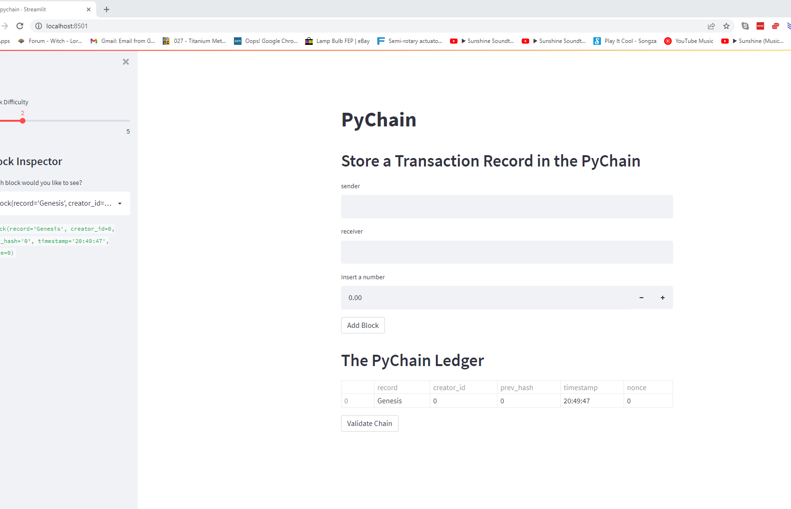

# PyChain Ledger

The floowing program is a blockchain-based leger demo using the streamlet packages from python. the image below shows the front page of the running application.

# PyChain_Demo

Records are stored and validatioted in this demo application.

